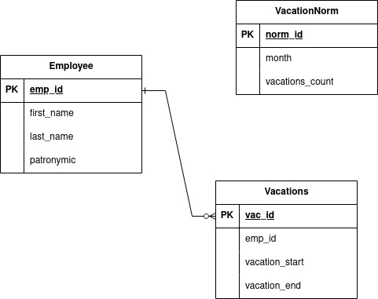
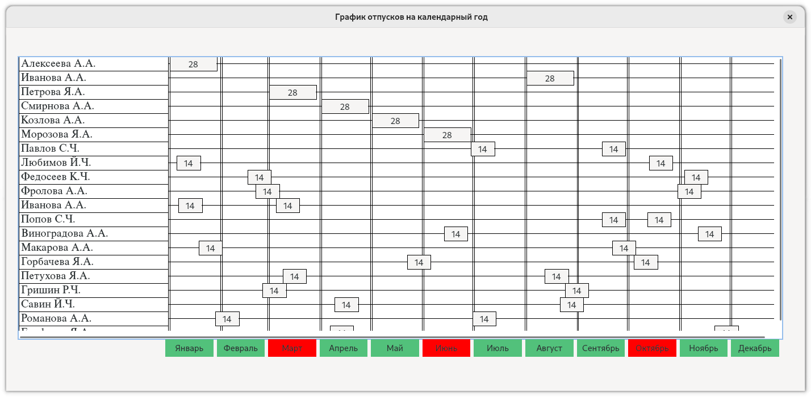

## Цель
Разработать программу с графическим интерфейсом пользователя с визуализацией графика отпусков сотрудников и цветовой индикацией календарных месяцев, для которых превышен указанный лимит по количеству сотрудников в месяц (норматив).

## Требования
* графический интерфейс программы должен быть на русском языке;
* календарный месяц, в котором превышен лимит по количеству сотрудников – отображать красным цветом, меньше или равно лимита – зеленым цветом;
* слева на графике должны отображаться Ф.И.О. сотрудников, снизу на графике – календарный месяц, в рабочей области графика – визуализация блока, обозначающего длительность отпуска в календарных днях (с тексом внутри блока по центру), при наведении курсора мыши на блок – отображать всплывающую подсказку с фактической датой начала и окончания отпуска;
* разработать структуру базы данных для хранения Ф.И.О сотрудников, нормативов количества сотрудников по месяцам на календарный год, даты начала и окончания отпусков для каждого сотрудника;
* для каждого сотрудника распределяется отпуск длительностью 28 календарных дней;
* заполнить тестовую базу данных минимум для 20 сотрудников.

## ER-диаграмма базы данных

## Структура приложения
Все приложение можно разделить на следующие части:

* Модели данных (классы, которые описывают сущности в базе данных)
	* Vacations::Models::Employee - сотрудник
	* Vacations::Models::VacationNorm - описание нормы по количеству отпусков в месяц
	* Vacations::Models::Vacation - отпуск сотрудника с датами начала и конца
* Классы репозиториев (выбор данных из базы и преобразование их в модели)
	* Vacations::Repositories::EmployeeRepository - репозиторий сотрудников
	* Vacations::Repositories::VacationNormRepository - репозиторий норм 
	* Vacations::Repositories::VacationRepository - репозиторий отпусков
* Класс QDbHelper - организует соединение с базой данных PostgreSQL и предоставляет подключение в виде класса QSqlDatabase
* Класс QDbConfig - предоставляет интерфейс для чтения конфигурации подключения к СУБД с помощью файла настроек settings.ini
* Класс QGanttDiagramm - отвечает за построение и отрисовку графика отпусков в виде диаграммы Ганта (построен на использовании Graphics View Framework)

## Подготовка и запуск приложения

Для того, чтобы запустить приложение, необходимо подготовить для него окружение:

1. В репозитории находится файл vacation.dump - он содержит дамп последнего состояния БД для приложения. Его необходимо накатить на существующую базу данных через утилиту pg_restore;
2. Файл settings.ini.example предоставляет шаблон для конфигурации подключения к БД. Туда необходимо внести свои данные и переименовать в settings.ini;
3. После этого приложение можно запускать через среду разработки.

## Пример работающего приложения

